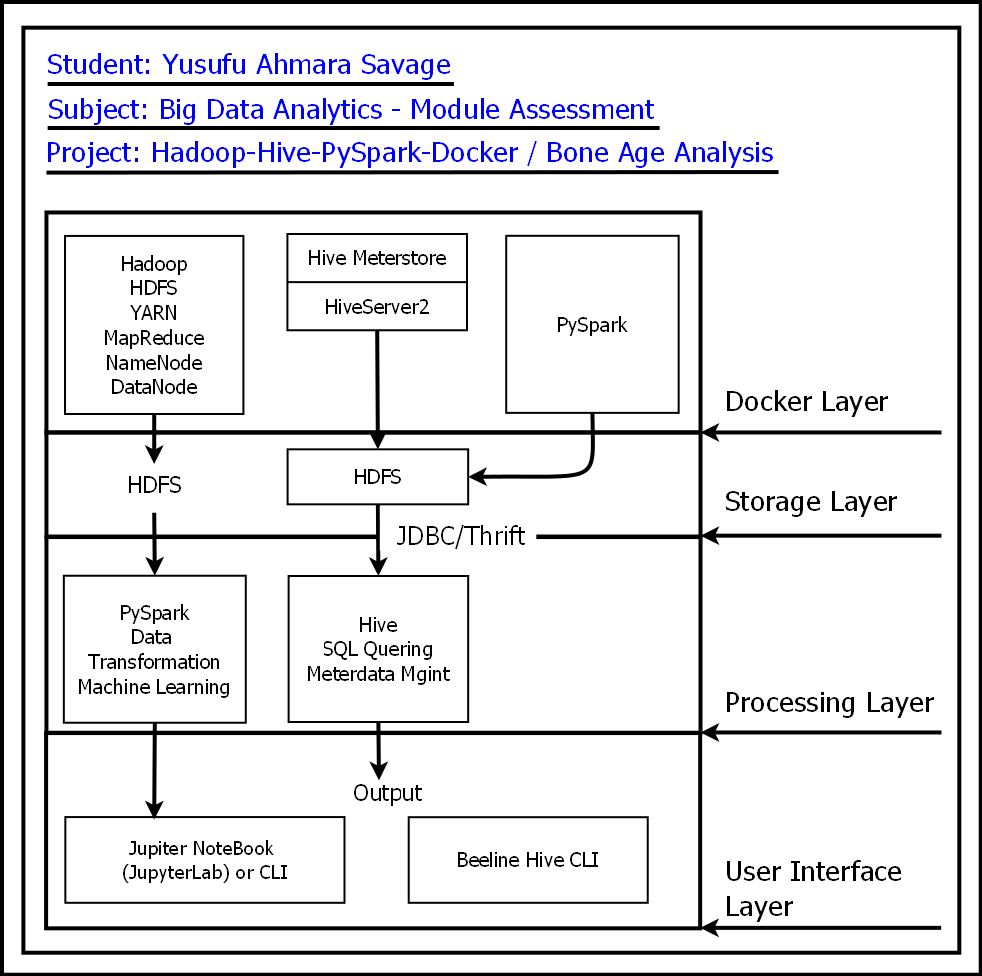

# Berlin School of Business and Innovation - BSBI 
#           University of Creative Arts
#       Big Data Analytics Assessment Project
---
# Hadoop + Hive + PySpark + Jupyter Docker Environment

This project provides a complete Docker-based environment for working with Hadoop, Hive, and PySpark using Jupyter Notebook. It is ideal for data engineers, analysts, and developers who want to experiment with big data tools locally. 

---

## 🚀 Features

- Hadoop (HDFS + YARN)
- Hive Metastore and HiveServer2
- PostgreSQL for Hive Metastore
- PySpark with Hive integration
- Jupyter Notebook interface for PySpark
- Sample notebook and Hive initialization script

---

## 📁 Project Structure
hadoop-hive-pyspark-docker/

|-- docker-compose.yml
|-- Dockerfile
|-- hive/hive-site.xml
|-- spark/spark-defaults.conf
|-- scripts/init-hive.sh
|-- notebooks/example.ipynb
|-- data/boneage-dataset.csv
|-- data/boneage-images/ . # ignored using GitIgnore
|-- assets/architecture.png
|-- README.md

